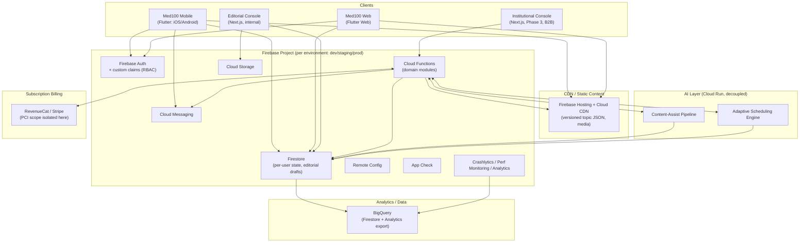
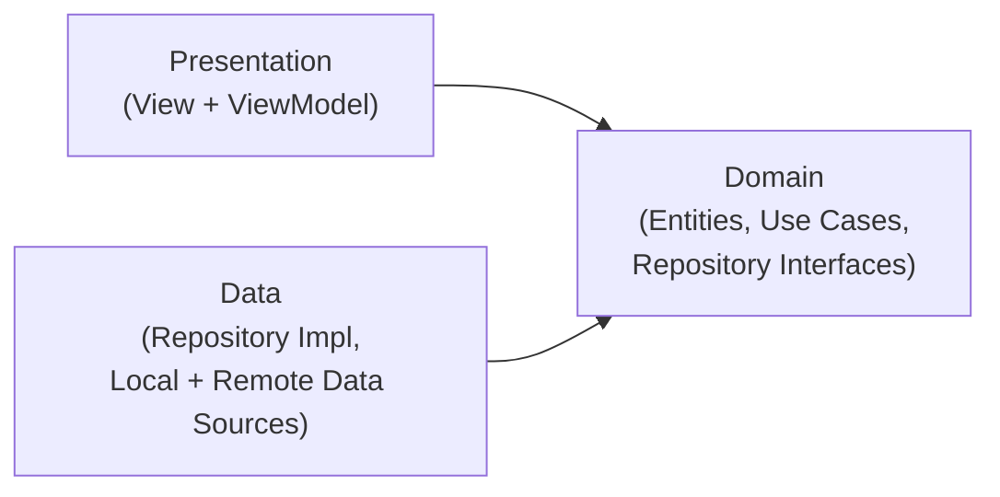
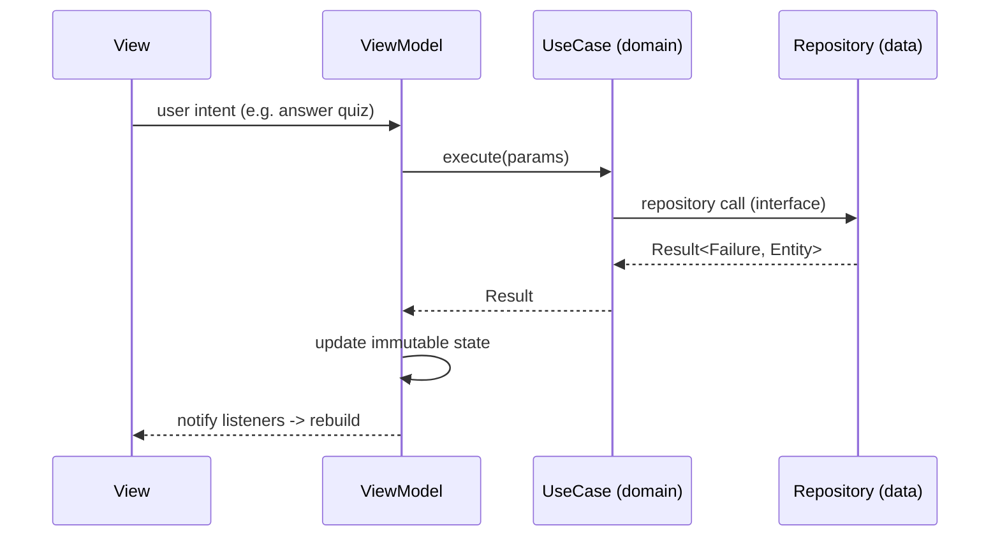

# Med100 — Software Architecture Document

**Based on:** Med100 PRD v1.0 (`docs/MED100_PRD.md`)
**Author:** Principal Software Architect
**Status:** Draft v1.0 — architecture documentation only, no implementation
**Last updated:** 2026-07-23

---

## 0. Assumptions Carried Forward From PRD Review

Two PRD ambiguities are resolved here as architectural decisions, so design can proceed without blocking on product re-litigation:

- **Free/Premium split (PRD contradiction #1):** Rather than hard-coding "Track A is free, Track B is premium" — which collided with the "never gate safety-critical content" principle — entitlement is modeled as a **data-driven flag per content unit** (`isFree: boolean` at topic *and* track level, editable from the Editorial Console / Remote Config). Product can decide and change the free/premium boundary without an engineering change, and can mark specific safety-critical ICU topics free even inside an otherwise-premium track.
- **Content data model precursor (PRD gap #4):** This document defines the topic/track/version data model (Section 7) so engineering has a concrete schema to build against instead of discovering it mid-sprint.

Everything else below assumes the MVP scope from the PRD: 2 specialty tracks, iOS + Android + Web, EN/AR, single premium tier, no institutional dashboard yet.

---

## 1. Software Architecture (System Overview)

### 1.1 Guiding style

**Modular monolith on a BaaS foundation, client-side Clean Architecture.** The backend is organized as domain-bounded modules within one Firebase project (not yet split into microservices), because the team is small, the MVP surface is narrow, and premature service-splitting would tax velocity without a proven bottleneck. Each backend module (Content, Learning/Progress, Identity, Notifications, Billing, AI, Institutional) is written with a clear internal boundary so any one of them can be extracted into an independently-deployed service later (see Section 12) once real load data justifies it.

### 1.2 System components



### 1.3 Component responsibilities

| Component | Responsibility |
|---|---|
| Mobile app (Flutter) | Primary learner surface: daily topic, quiz, streaks, offline library, clinical reference calculators |
| Web app (Flutter Web) | Same learner experience, browser-accessible, lower priority than mobile for MVP |
| Editorial Console (Next.js) | Internal tool for specialist authors/reviewers to draft, review, publish, and version topic content |
| Institutional Console (Next.js, Phase 3) | B2B cohort dashboards, compliance reporting for hospital/med-school admins |
| Firebase Auth | Identity, session management, custom claims for role-based access |
| Firestore | Operational database: per-user progress/state, editorial drafts, institutional cohort metadata |
| Cloud Functions | All server-side business logic, organized by domain module; sole writer of shared/derived state |
| CDN (Hosting) | Serves published, versioned topic content and media as cache-friendly static payloads — deliberately kept out of Firestore's read path (see Section 12) |
| Cloud Messaging | Daily topic push notifications, timezone-bucketed |
| AI Layer (Cloud Run) | Content-assist drafting and adaptive scheduling, both async and human-gated |
| BigQuery | All heavy analytics/reporting, isolated from production Firestore |
| Billing provider | Owns PCI scope entirely; Med100 backend only consumes signed webhooks |

---

## 2. Folder Structure

Feature-first organization layered with Clean Architecture inside each feature, consistent across all Flutter surfaces.

```
med100/
├── app_mobile/                      # Flutter app (iOS/Android/Web target)
│   ├── lib/
│   │   ├── main.dart
│   │   ├── app/
│   │   │   ├── app.dart             # MaterialApp/CupertinoApp shell
│   │   │   ├── router/              # go_router route table
│   │   │   ├── theme/               # design tokens, light/dark themes
│   │   │   └── bootstrap/           # env flavors, Firebase init, DI root
│   │   ├── core/                    # cross-cutting, no feature knowledge
│   │   │   ├── error/               # Failure types, Result<L,R>
│   │   │   ├── network/             # Dio client, interceptors, connectivity
│   │   │   ├── sync/                # outbox worker, conflict resolution
│   │   │   ├── localization/
│   │   │   └── analytics/           # analytics facade (provider-agnostic)
│   │   ├── features/
│   │   │   ├── daily_topic/
│   │   │   │   ├── data/
│   │   │   │   │   ├── datasources/ # remote (CDN/Firestore) + local (Drift)
│   │   │   │   │   ├── models/      # DTOs + mappers
│   │   │   │   │   └── repositories/# impl of domain repository interface
│   │   │   │   ├── domain/
│   │   │   │   │   ├── entities/
│   │   │   │   │   ├── repositories/# abstract interfaces only
│   │   │   │   │   └── usecases/    # GetTodaysTopic, SubmitQuizAnswer...
│   │   │   │   └── presentation/
│   │   │   │       ├── viewmodels/  # Riverpod Notifiers
│   │   │   │       ├── screens/
│   │   │   │       └── widgets/
│   │   │   ├── spaced_repetition/
│   │   │   ├── streaks_mastery/
│   │   │   ├── specialty_tracks/
│   │   │   ├── exam_mode/
│   │   │   ├── auth_onboarding/
│   │   │   ├── subscription_billing/
│   │   │   ├── offline_library/
│   │   │   ├── clinical_reference/  # calculators, protocol cards
│   │   │   └── notifications/
│   │   ├── shared/                  # design system components
│   │   └── l10n/                    # .arb translation files
│   └── test/
│       ├── unit/                    # mirrors lib/features/*/domain,data
│       ├── widget/
│       └── integration/
│
├── backend/
│   ├── functions/                   # Cloud Functions, TypeScript
│   │   ├── src/
│   │   │   ├── content/             # publish, version, entitlement
│   │   │   ├── learning/            # progress, SRE recompute, mastery
│   │   │   ├── identity/            # custom claims, role assignment
│   │   │   ├── notifications/       # scheduled fan-out
│   │   │   ├── billing/             # webhook handlers
│   │   │   ├── institutional/       # cohort aggregation (Phase 3)
│   │   │   └── ai_bridge/           # thin triggers calling ai_service
│   │   └── index.ts
│   ├── firestore.rules
│   ├── firestore.indexes.json
│   └── storage.rules
│
├── ai_service/                      # Cloud Run, Python
│   ├── content_assist/
│   ├── adaptive_scheduler/
│   └── guideline_diff/
│
├── editorial_console/               # Next.js, internal
└── institutional_console/           # Next.js, Phase 3
```

Rule enforced by lint/CI: nothing under `domain/` may import Flutter, Firebase, or any package-specific type. Violations fail the build.

---

## 3. Clean Architecture

Three concentric layers per feature, dependencies pointing strictly inward:



- **Domain layer** — pure Dart, zero framework dependency. Holds entities (`Topic`, `QuizAttempt`, `UserProgress`, `Streak`), repository *interfaces*, and use cases (one class per user intent: `GetTodaysTopicUseCase`, `SubmitQuizAnswerUseCase`, `GetDueReviewsUseCase`). This is the layer that could be unit-tested and reasoned about without ever booting Flutter or Firebase.
- **Data layer** — implements domain repository interfaces. Owns DTO↔entity mappers, local data source (Drift) and remote data source (Firestore/CDN) implementations, and the offline-first merge logic (Section 9).
- **Presentation layer** — Views are declarative and dumb; ViewModels hold UI state and call use cases only, never repositories or Firebase SDKs directly.

**Why this matters for Med100 specifically:** the PRD roadmap includes a Phase 3 backend evolution (AI-personalized scheduling, possible service extraction) and a Phase 4 possibility of white-labeling or a partner SDK. Clean Architecture is what makes "swap Firestore for a partner's LMS backend" or "replace the SRE algorithm" a data-layer change instead of a rewrite.

---

## 4. MVVM

- **View** — Flutter widgets, stateless where possible, observe ViewModel state via Riverpod `ref.watch`, never contain business logic or direct data access.
- **ViewModel** — implemented as Riverpod `Notifier`/`AsyncNotifier` classes. Exposes an immutable UI state object (e.g., `DailyTopicState { loading, data, error }`) and intent methods (`onQuizAnswerSelected(...)`). Converts domain entities into view-ready shapes (e.g., formatting mastery % as a string, localized date labels).
- **Model** — domain entities and use-case results; ViewModels never expose raw Firestore documents or DTOs to the View.

**Unidirectional data flow:**



Every ViewModel returns a `Result`/`Either`-style type from use cases rather than throwing — errors are values, rendered as an explicit UI error state, never an uncaught exception reaching the widget tree.

---

## 5. Repository Pattern

One repository interface per aggregate, declared in `domain/repositories/`:

- `TopicRepository` — fetch today's topic, fetch by ID, list track topics
- `ProgressRepository` — quiz attempts, mastery %, streak state
- `SpacedRepetitionRepository` — due-review queue, interval updates
- `UserRepository` — profile, role, specialty selections, notification prefs
- `SubscriptionRepository` — entitlement state (free/premium, per-topic override)

Each implementation in `data/repositories/` composes:
1. A **LocalDataSource** (Drift) — source of truth for reads, always queried first.
2. A **RemoteDataSource** (Firestore SDK + CDN fetch for content payloads) — used to refresh local cache and to drain the offline write outbox.

Repositories are the *only* place that knows both data sources exist; domain and presentation only ever see the interface. This is what lets tests substitute an in-memory fake repository with zero Firebase dependency, and what lets the offline-first strategy (Section 9) live in one well-tested place instead of being reimplemented per feature.

---

## 6. Dependency Injection

**Single mechanism: Riverpod providers act as the DI container** — no second service-locator framework (e.g., get_it) is introduced, to avoid running two competing DI graphs.

- `dataSourceProvider` → `repositoryProvider` (the only providers allowed to reference Firebase types) → `useCaseProvider` → `viewModelProvider` (scoped `autoDispose` by default, to avoid leaking state on ephemeral screens like a single quiz session).
- **Composition root** lives in `app/bootstrap/`, where build-flavor-specific overrides are injected (`ProviderScope(overrides: [...])`) to point at dev/staging/prod Firebase projects — this is also the seam used to inject fakes in widget/integration tests, so tests never touch a real Firebase project.
- Cross-cutting services (analytics facade, connectivity checker, sync worker) are themselves providers, injected into ViewModels rather than accessed as globals/singletons — keeps every class's dependencies explicit and mockable.

---

## 7. Firebase Architecture

### 7.1 Auth

- Firebase Auth with email/password, Google, Apple, and phone-number sign-in (phone matters for regions where email adoption is low, per PRD target markets).
- **Custom claims** carry `role` (`learner | editor | admin | institution_admin`) and, for institutional users, `institutionId`. Claims are set exclusively by a trusted Cloud Function (`identity` module) — never client-writable.

### 7.2 Firestore data model

```
users/{userId}
  profile: { role, specialties[], notificationTime, locale }
  users/{userId}/progress/{topicId}
    { quizScore, attempts[], masteryDelta, lastReviewedAt }
  users/{userId}/streaks/{trackId}
    { currentStreak, longestStreak, lastActiveDate }
  users/{userId}/sreSchedule/{topicId}
    { nextReviewDate, intervalDays, easeFactor }

specialties/{specialtyId}/tracks/{trackId}
  { name, isFree, order }
  specialties/{specialtyId}/tracks/{trackId}/topics/{topicId}
    { title, version, isFree, contentRef (CDN path), publishedAt, examMappings[] }

contentDrafts/{draftId}          # editorial workflow, not learner-facing
  { status: draft|in_review|approved|published, authorId, reviewerIds[] }

subscriptions/{userId}
  { tier, source: 'revenuecat', expiresAt }     # mirrored via webhook, read-only to client

institutions/{institutionId}/cohorts/{cohortId}   # Phase 3
  { memberIds[], assignedTracks[], complianceStats }
```

Design principle: **denormalize for reads, centralize writes in Cloud Functions.** Firestore is not relationally joined at read time; anything requiring aggregation (mastery rollups, institutional compliance %) is computed server-side and written to a denormalized field, never computed client-side from multiple collections.

### 7.3 Cloud Functions (domain-organized, 2nd gen, TypeScript)

- `content`: draft→review→publish state machine, version stamping, CDN payload generation on publish.
- `learning`: quiz submission validation, mastery recompute, SRE interval update (SM-2-style algorithm, MVP = fixed rule, Phase 2+ = calls `ai_bridge`).
- `notifications`: Cloud Scheduler–triggered, timezone-bucketed daily fan-out via Pub/Sub + Cloud Tasks (not a single loop — see Section 12).
- `billing`: RevenueCat/Stripe webhook receiver, writes to `subscriptions/{userId}`.
- `institutional` (Phase 3): cohort compliance aggregation, scheduled nightly.
- `ai_bridge`: thin async trigger forwarding to the Cloud Run AI services; never called synchronously from the client.

### 7.4 Supporting Firebase services

- **Cloud Storage** — media assets, offline bundle archives, generated CME certificate PDFs. Served via signed, short-TTL URLs for premium content.
- **Remote Config** — feature flags, paywall/entitlement experiments, staged track rollouts.
- **App Check** — enforced on every Callable Function and Firestore access path, blocking non-genuine app instances from scraping content or scripting abuse.
- **Crashlytics / Performance Monitoring / Analytics** — baseline observability; custom analytics events map directly to the PRD's Section 11 success metrics.
- **BigQuery export** — nightly Firestore + Analytics export; all heavy aggregation (retention curves, cohort funnels) runs here, never against production Firestore.

---

## 8. Local Database

**Choice: Drift (SQLite)** over key-value stores (Hive/Isar) — the deciding factor is the spaced-repetition query pattern: *"give me all topics due for review today, across tracks, ordered by priority,"* which is a natural relational query and awkward in a pure key-value/document local store.

Local schema (mirrors a subset of Firestore, plus device-only tables):

| Table | Purpose |
|---|---|
| `cached_topics` | Downloaded topic content (current + prior 7 days by default; full track if downloaded-ahead) |
| `quiz_attempts_log` | Append-only, local source of truth until synced |
| `sre_schedule` | `topicId, nextReviewDate, intervalDays, easeFactor` — SM-2-like state |
| `streaks_cache` | Per-track streak snapshot for instant offline render |
| `outbox` | Pending mutations (quiz submissions, streak updates) awaiting sync, with client-generated UUID + retry count |

The local DB is the **only** thing the presentation layer reads from directly (via repository); Firestore is a sync target, never a direct read dependency of the UI.

---

## 9. Cloud Sync

**Offline-first, local-DB-is-truth-for-reads, outbox-is-truth-for-pending-writes.**

- **Read path:** Repository serves from Drift instantly. A background sync listener (Firestore snapshot listener when online) upserts remote changes into Drift; the UI is driven by a Drift stream, so it updates reactively whether the write came from local action or remote sync — the UI never needs to know which source produced the update.
- **Write path:** Every mutation writes to the local `outbox` table synchronously (optimistic UI update), then a background sync worker drains the outbox to Cloud Functions when connectivity returns, with exponential backoff.
- **Conflict resolution:**
  - Scalar fields (streak count, mastery %) — **last-write-wins by server timestamp**, since conflicts here are rare and low-stakes.
  - Append-only logs (quiz attempts) — **never overwritten**, merged by client-generated UUID + timestamp, so a user on two devices doesn't lose an attempt either side recorded.
  - Content — **immutable-once-published**; sync is pure cache invalidation via a `version` field comparison, not a merge.
- **Idempotency:** every outbox mutation carries a client-generated UUID; Cloud Functions dedupe on that ID, so retry-after-timeout (common on ward Wi-Fi) never double-counts a quiz attempt or double-increments a streak.

---

## 10. AI Layer

Deliberately isolated from the user-facing request path — both AI subsystems are **async, batch-oriented, and human-gated**, never inline in a learner's tap-to-response loop.

### 10.1 Content-Assist Pipeline (Phase 3)

- Cloud Run service drafts topic content and flags existing topics for re-review when a source guideline changes (guideline-diff job).
- Output lands exclusively in `contentDrafts/{draftId}` with status `draft` — it is **never** published without passing through `in_review → approved` in the Editorial Console, matching the PRD's 100%-physician-review requirement.
- Triggered by Cloud Scheduler or an editor's explicit request — not by end-user activity — so its cost and latency never affect the learner experience.

### 10.2 Adaptive Scheduling Engine (Phase 3+)

- Consumes anonymized quiz-performance events from BigQuery to recompute personalized SRE intervals (replacing the MVP's fixed-interval schedule) and topic-ordering hints.
- Runs as a scheduled batch job, writing results back to `users/{userId}/sreSchedule/*` — the mobile client stays "dumb," simply reading whatever schedule is there; no on-device ML runtime is required for MVP or this phase.

### 10.3 Vendor abstraction

Both subsystems sit behind an internal interface (`ContentGenerationPort`, `SchedulingPort`) inside `ai_bridge` — the underlying LLM/ML provider can be swapped without touching client code or core Cloud Functions, avoiding lock-in to a single AI vendor.

---

## 11. Offline Strategy

- **Default cache:** current day + prior 7 days per subscribed track, capped at a configurable storage budget (e.g., 200MB) with LRU eviction of oldest non-favorited topics.
- **Premium download-ahead:** explicit user action to cache a full track; Wi-Fi-only by default, size shown before download.
- **Full offline functionality:** quiz-taking, streak updates, and SRE review all work with zero connectivity; sync is deferred, never blocking, via the outbox (Section 9).
- **Connectivity-aware UX:** a non-intrusive sync-status indicator (synced / pending / offline) builds trust that ward-Wi-Fi dead zones won't silently lose data.
- **Notification resilience:** if FCM delivery fails (common in low-connectivity regions), an on-device local-notification fallback still fires based on the last-synced release schedule, protecting the daily-habit loop that the whole retention model depends on.

---

## 12. Security

- **Transport:** TLS everywhere by default (Firebase); certificate pinning evaluated for the mobile client given frequent use on hospital/public Wi-Fi.
- **AuthZ enforcement point:** **Firestore Security Rules**, not client-side role checks — every rule keyed off custom claims and resource ownership (`request.auth.uid == resource.data.userId`, `request.auth.token.role in [...]`). The client-side RBAC in the UI is a UX convenience only, never the security boundary.
- **Editorial isolation:** the Editorial Console authenticates against a more restrictive auth surface than the consumer app (separate custom-claim scope, considered for a separate GCP project) so a consumer-app compromise can't cascade into content-publishing access.
- **Data classification:** Med100 holds no patient data (PHI) — it holds clinicians'/students' own learning records and professional identity, which is still sensitive and is encrypted at rest by default (Firestore) with field-level rule restrictions.
- **App Check:** mandatory on every Function/Firestore path, blocking scripted scraping of specialist-authored content and abuse of gamification endpoints.
- **Secrets:** Google Secret Manager for all provider keys (AI, payment webhooks) — never in client bundles or plaintext Function env vars.
- **Payments:** PCI scope fully delegated to RevenueCat/Stripe; Med100 backend only ever consumes signed webhook events, never raw card data.
- **Abuse/rate limiting:** Function-level throttling plus Firestore rules capping write frequency (e.g., max quiz submissions/minute) to prevent scripted streak/mastery gaming.
- **Content protection:** signed, short-TTL Cloud Storage URLs for premium media, reducing casual redistribution of paid content.
- **Compliance:** GDPR-aligned data export/delete via a dedicated Cloud Function; data residency/multi-region evaluated per-contract once institutional (Phase 3) customers require it — not built speculatively into MVP.

---

## 13. Scalability

- **Serverless-first:** Firestore + Cloud Functions scale horizontally with no MVP-stage capacity planning.
- **Read-storm avoidance (the key scale decision):** shared topic *content* is published as versioned, CDN-cacheable static payloads (Hosting/Cloud CDN), **not** read live from Firestore per user. Firestore only ever holds *per-user* state. This means a million users opening "today's topic" at their local 7am doesn't translate into a million concurrent Firestore reads of the same document — it's a CDN cache hit.
- **Notification fan-out:** architected as Pub/Sub + Cloud Tasks batches, not a single Function iterating every user — avoids timeout/throughput ceilings as DAU grows into the millions.
- **Cold starts:** minimum-instance configuration reserved for latency-sensitive endpoints (auth, today's-topic bootstrap) once DAU justifies the always-on cost.
- **Analytics isolation:** BigQuery absorbs all heavy aggregation; production Firestore is never queried for reporting.
- **Extraction path, not a rewrite:** because backend modules are already domain-bounded (Section 1), any one module (e.g., Notifications or the AI bridge) can become an independently-scaled Cloud Run service later without touching the others — deferred until real load data, not designed in from day one.
- **Multi-region:** deliberately deferred until an institutional contract requires data residency (Phase 3) — avoids a complexity tax the MVP doesn't need.

---

## 14. Performance Strategy

- **Cold start budget:** target splash-to-interactive under ~2s on mid-tier Android hardware — reflective of the PRD's emerging-market device profile, not top-tier flagship devices.
- **Local-first rendering:** as established in Sections 8–9, the UI always renders from Drift first; perceived performance is decoupled from network quality, which matters directly for the PRD's low-bandwidth target users.
- **Media delivery:** CDN-served images/video, responsive resolutions, modern compression (WebP/AVIF), lazy-loaded below the fold.
- **List performance:** virtualized rendering for any long list (topic history, leaderboards) to protect frame budget on low-end devices.
- **Background work discipline:** sync/notifications batched and triggered on foreground/background transitions or Wi-Fi-connect events — never aggressive polling — respecting OS background-execution limits and user battery/data budgets.
- **Query planning:** composite Firestore indexes defined up front per known repository query pattern (`firestore.indexes.json`), so slow scans or runtime index errors don't surface post-launch.
- **Performance as a product metric:** Firebase Performance Monitoring traces are wired around the exact journeys that drive retention (topic load, quiz submit, sync completion) — slow performance is treated as a direct threat to the PRD's D1/D7 retention targets, not a separate engineering concern.

---

*This document defines architecture only. No implementation code is included. Next phase: technical design specs per module (data contracts, API signatures, CI/CD pipeline) before implementation begins.*
